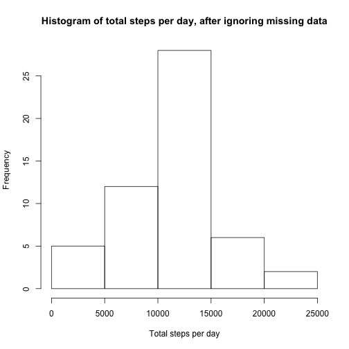
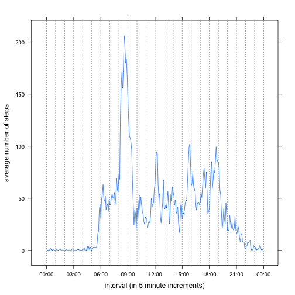
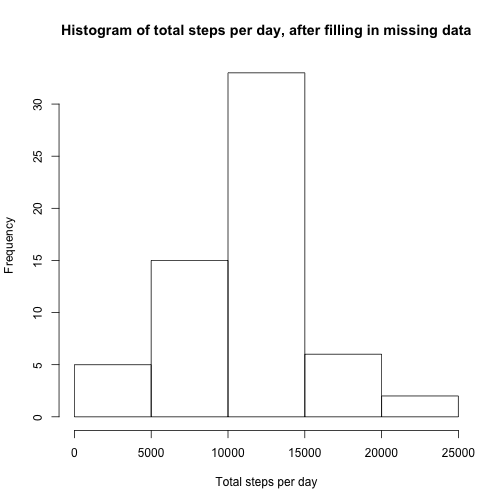
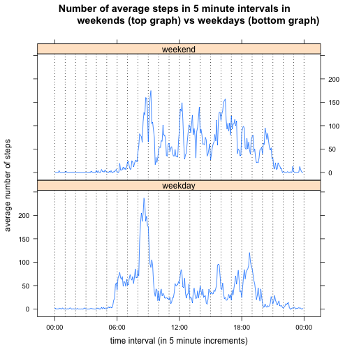

## Steps to reproduce HTML file

The source code of this markdown can be found at:
https://github.com/rayyanj/RepData_PeerAssessment1

In order to fully reproduce this analyis:

- Clone the repository at https://github.com/rayyanj/RepData_PeerAssessment1
using the following command:

        > git clone https://github.com/rayyanj/RepData_PeerAssessment1

- Open R and set working directory to be same as the main directory in the 
cloned repository. The main directory should contain a file called 
"PA1_template.Rmd".

- Install "knitr"" package if you haven't done so yet using the command:

        > install.packages("knitr")

- Run the following command to produce the "PA1_template.md"
and "PA1_template.html" files and the "figure" folder that contains
the 4 plots.

        > library(knitr)
        > knit2html("PA1_template.Rmd")

## Loading and preprocessing the data

Below I describe how I load and preprocess the data.

* Loading data: documents loading the raw data in memory, downloading it
from the web if not available on disk already.

* Preprocessing data: documents how converting the raw columns into types
that easier to deal with this for this analysis.

### Loading data
Here are the steps to load the data:

* Download the raw dataset from
        https://d396qusza40orc.cloudfront.net/repdata%2Fdata%2Factivity.zip 
if it hasn't been downloaded already and store it in
current working directory.
 
* Unzip the activity.zip file and verify that it contains activity.csv file

* Read the csv file using ```read.csv()``` method. It should contain three 
columns: steps, date and interval. Parse "steps" and "interval" as integer
columns and date as character column. It will be converted to proper date
in the next section (see Preprocessing data).


```r
zipFilename <- "activity.zip"
rawCsvFile <- "activity.csv"
fileUrl <- "https://d396qusza40orc.cloudfront.net/repdata%2Fdata%2Factivity.zip"

# Download the file from the internet if it's not available locally
# and record URL and time it was downloaded.
if (!file.exists(zipFilename)) {
        downloadResult <- download.file(fileUrl,
                                        zipFilename,
                                        method = "curl");
        
        if (downloadResult != 0) {
                stop(paste("Unable to download file from", fileUrl))
        }
        
        # Record the URL and time when the file was downloaded in a readme file
        # in same directory where the dwonloaded zip file resided.
        rawDataReadMeFilePath <- paste0("activity_zip_readme.txt");
        write(paste("The raw data file", zipFilename, "was downloaded from", fileUrl, "on", 
                    format(Sys.time(), tz="America/Los_Angeles",usetz=TRUE)),
              rawDataReadMeFilePath);
}

# Unzip the file
unzip(zipFilename, exdir = ".")
        
# Make sure the csv file that we expect is now available on disk.
# Otherwise, print an error message.
if (!file.exists(rawCsvFile)) {
        stop(paste("Expected to find", rawCsvFile, "in working directory but file was not found."))
}

# Load the file
rawActivityData <- read.csv(rawCsvFile,
                            header = TRUE,
                            colClasses = c("integer", "character", "integer"))
```

Sample rows from the raw activity data:

```r
head(rawActivityData)
```

```
##   steps       date interval
## 1    NA 2012-10-01        0
## 2    NA 2012-10-01        5
## 3    NA 2012-10-01       10
## 4    NA 2012-10-01       15
## 5    NA 2012-10-01       20
## 6    NA 2012-10-01       25
```

### Preprocessing data 

Below I describe pre-processing steps:

* Parse the "date" column from raw dataset to a proper date column using
```strptime``` method with the format ```%Y-%m-%d"```. Assume the date is in
UTC since we don't have any information about timezone. Timezone doesn't really
matter for the purposes of this analyis.

* Convert the "interval" column from raw dataset to a proper ```times``` column
by first converting it to the format "hh:mm:ss" and then using the ```times()```
method  to convert it to a ```times``` class. ```times``` is a very handy
class from ```chron``` package for manipulating time data
(See https://cran.r-project.org/web/packages/chron/chron.pdf for more
information). For example, in plots where one of the variables in a times
variable, the labels will be formatted nicely to indicate time of the day
(e.g. 03:00, 06:00, 09:00).

The following method ```installPackageIfNeeded``` installs package, such
as ```chron``` if it has not already been installed.


```r
# 
# Installs package if not already installed. If the package is already
# installed, then this is a no-op.
#
# packageName: the name of the package to install, e.g. "chron" 
#
installPackageIfNeeded <- function(packageName) {
        if (!(packageName %in% rownames(installed.packages()))) {
                message(paste("Package", packageName, "was not found. Will attempt to install."))
                install.packages(packageName)
                message(paste("Package", packageName, "installed."))
        } else {
                 message(paste("Package", packageName, "was found. Nothing to install."))
        }
}

installPackageIfNeeded("chron")
library(chron)

message("Parsing the day from date column as date objects for easier
        date manipulation.")
day <- strptime(rawActivityData$date, "%Y-%m-%d", tz="UTC")

message("Parsing the interval from raw dataset as a times object (from chron
        package) for easier time manipulation, e.g. better labels in graphs
        involving time intervals.")

# Add leading 0's to the intervals so that they're always of the format hhmm
intervalsFormatted <- formatC(rawActivityData$interval, width = 4, flag = "0")

# Format the intervals as "hh:mm:ss" so that they can be easily parsed by
# times()
intervalsFormatted <- paste0(substring(intervalsFormatted,1,2),":",
                             substring(intervalsFormatted,3,4),":",
                             "00");

interval <- times(intervalsFormatted)

tidyData <- data.frame(day, interval, steps = rawActivityData$steps)
```

The resulting processed dataset has three columns:

- ```day```, of type ```POSIXct``` representing the day date the measurement
was obtained, in "%Y-m-d" format, e.g. "2012-10-01"

- ```interval```, of type ```times``` representing the start time of the 5
minute interval. For example, "06:30:00" represents the 5 minute interval
starting at 6:30 AM and ending in 6:35 AM. Note: 24 hour format is used, so
6:30 PM will be represented as "18:30:00".

- ```steps```, of type ```int```, representing the number of steps performed or NA
if the measurement for this day and time is missing.

Here are sample rows from the processed data:

```r
head(tidyData)
```

```
##          day interval steps
## 1 2012-10-01 00:00:00    NA
## 2 2012-10-01 00:05:00    NA
## 3 2012-10-01 00:10:00    NA
## 4 2012-10-01 00:15:00    NA
## 5 2012-10-01 00:20:00    NA
## 6 2012-10-01 00:25:00    NA
```


## What is mean total number of steps taken per day?

### Calculating the total number of steps per day

- In order to find total number of steps per day, we need to group
our dataset by day and take the sum of all steps. This gives us a new dataset
```numberOfStepsPerDay``` which contains the total number of steps for a given
day.

- If a row has missing steps, I decided it to remove it before the aggregation.
Otherwise, if I kept the row there and did the aggregation, passing na.rm to the
sum function, if all the steps in a day are missing, it would still generate
a row in the aggregate dataset for that day with 0 steps. But that would be
a wrong measurement because steps is really not known for that day. For this
reason, I remove the row before the aggregation.

```dplyr`` package is very handy for this. Below is the code that can
achieve this.


```r
installPackageIfNeeded("dplyr")
library(dplyr)

# Ignore missing values:
# Ignore missing values using filter() step prior to the summarize
# step to avoid having days with no measurements in them report 0 totals.
numberOfStepsPerDay = tidyData %>%
        filter(!is.na(steps)) %>%
        group_by(day) %>%
        summarize(totalSteps = sum(steps))
```

Here are sample rows from ```numberOfStepsPerDay```:

```r
head(numberOfStepsPerDay)
```

```
## Source: local data frame [6 x 2]
## 
##          day totalSteps
##       (time)      (int)
## 1 2012-10-02        126
## 2 2012-10-03      11352
## 3 2012-10-04      12116
## 4 2012-10-05      13294
## 5 2012-10-06      15420
## 6 2012-10-07      11015
```

### Histogram of total steps taken each day

Below is a histogram showing the frequency of total number of steps per day in
the dataset after ignoring missing rows.


```r
histogramStepsPerDayMissingDataIgnored <- hist(numberOfStepsPerDay$totalSteps,
     main = "Histogram of total steps per day, after ignoring missing data",
     xlab = "Total steps per day")
```

 

### Mean and median of total steps taken each day


```r
meanTotalNumberOfStepsPerDay <- mean(numberOfStepsPerDay$totalSteps)
meanTotalNumberOfStepsPerDay
```

```
## [1] 10766.19
```

The mean of the total steps per day, with missing data ignored, is
10766.19


```r
medianTotalNumberOfStepsPerDay <- median(numberOfStepsPerDay$totalSteps)
medianTotalNumberOfStepsPerDay
```

```
## [1] 10765
```

The median of the total steps per day, with missing data ignored, is
10765.00

## What is the average daily activity pattern?

### Computing daily pattern

In order to compute average daily activity pattern, we aggregate along the
interval, computing the mean of steps for each 5 minute interval.


```r
installPackageIfNeeded("lattice")
library(lattice)

averageNumberOfStepsPerInterval = tidyData %>%
        filter(!is.na(steps)) %>%
        group_by(interval) %>%
        summarize(averageSteps = mean(steps))
```

Here are sample rows showing average number of steps per interval for the first
few intervals:

```r
head(averageNumberOfStepsPerInterval)
```

```
## Source: local data frame [6 x 2]
## 
##   interval averageSteps
##     (tims)        (dbl)
## 1 00:00:00    1.7169811
## 2 00:05:00    0.3396226
## 3 00:10:00    0.1320755
## 4 00:15:00    0.1509434
## 5 00:20:00    0.0754717
## 6 00:25:00    2.0943396
```

### Time series plot of average steps per time interval

Below, I used the lattice plotting system to make a time series plot of average
steps per time interval.


```r
intervalWithMostSteps <- averageNumberOfStepsPerInterval[which.max(averageNumberOfStepsPerInterval$averageSteps),]

xyplot(averageSteps ~ interval, data = averageNumberOfStepsPerInterval,
       type="l",
       scales=list(x=list(tick.number = 7)),
       xlab = "interval (in 5 minute increments)",
       ylab = "average number of steps",
       panel = function(...) {
               # Draw a dotted vertical grid line for each hour
               panel.abline(v=seq(0,1,1/24), lty=3)
               panel.xyplot(...)
        }
       )
```

 

### 5 minute interval with the most steps

The table below shows the maximum average steps in a 5 minute interval and
the interval at which this maximum is achieved:


```r
intervalWithMostSteps <- averageNumberOfStepsPerInterval[which.max(averageNumberOfStepsPerInterval$averageSteps),]

intervalWithMostSteps
```

```
## Source: local data frame [1 x 2]
## 
##   interval averageSteps
##     (tims)        (dbl)
## 1 08:35:00     206.1698
```

From the table, we can see that:

- The maximum average number of steps in a 5 minute interval is 206.17.

- The interval with most number of steps is the 5 minute interval starting at 08:35:00 (and ending 5 minutes later at 08:40:00).

## Imputing missing values

### Calculating number of rows with missing steps


```r
indicesOfMissingData <- which(is.na(tidyData$steps))
numberOfRowsWithMissingData <- length(indicesOfMissingData)
numberOfRowsWithMissingData
```

```
## [1] 2304
```

The number of rows with missing steps is 2304.

### Strategy to fill in missing values

In order to come up with a strategy to fill in missing values:

- I first explore more in depth the data that is missing.

- I chose a strategy to fill in missing data.

#### Exploring which dates have missing steps

Let us explore which dates have missing values:


```r
daysWithMissingValues <- unique(tidyData[indicesOfMissingData,]$day)
numberOfDaysWithMissingValues <- length(daysWithMissingValues)

numberOfDaysWithMissingValues
```

```
## [1] 8
```

```r
# We use format method here to omit timezone information
format(daysWithMissingValues)
```

```
## [1] "2012-10-01" "2012-10-08" "2012-11-01" "2012-11-04" "2012-11-09"
## [6] "2012-11-10" "2012-11-14" "2012-11-30"
```

From above, we can see that there are 8 dates with
missing values.

Let us explore which days of the week (i.e. Mondays, Tuesdays, etc.) have
missing data. We can accomplish this by using `weekdays()` method as shown
in the table below showing number of dates with missing value that fall
on a particular week day:


```r
table(weekdays(daysWithMissingValues))
```

```
## 
##    Friday    Monday  Saturday    Sunday  Thursday Wednesday 
##         2         2         1         1         1         1
```

The table shows that missing days are pretty distributed through out the week,
expect for Tuesday: it seems we always have data available for Tuesdays
in the time period of the study.

Let us explore further to see if the dates that have some intervals with
missing values have any other intervals with steps available.


```r
numberOfIntervalsWithDataInDaysThatHaveMissingData <-
sum(
        # intervals that fall in days that have missing data
        (tidyData$day %in% daysWithMissingValues) 
        # that have data available
        & !is.na(tidyData$steps)
)

numberOfIntervalsWithDataInDaysThatHaveMissingData
```

```
## [1] 0
```

The number of intervals with data available that lie in days that have missing
data is 0. That means:

- No steps is provided for any interval in the 8 
days that have missing data.

- For any day that has an interval with missing data in the raw dataset,
the entire day actually has missing data.

- There are 24 x 12 = 288 five-minute intervals in a 24 hour period.
It follows from above, that for 8 days with missing data, we have 8 x 288 =
2304 rows with missing data. This number matches what we found above using
`length(which(is.na(tidyData$steps)))` method.

#### Chosen strategy to fill in missing values

I decided to fill in missing values with the average steps corresponding to the
same time interval on the same week day. Here's an example to illustrate this
strategy:

For example, the number of steps on "2012-10-01" at "00:00:00" time interval
is missing. Since "2012-10-01" is a Monday, then my strategy is to compute the
average number of steps for all Mondays in the dataset for the "00:00:00" time
interval and use that to fill in the missing value for date "2012-10-01" and
interval "00:00:00".

### Creating a new dataset with filled in values

To implement the strategy I described above:

- I introduce a new column in the dataset called ```weekday``` that tracks
the day of the week the day corresponds to, e.g. "Monday", "Tuesday", etc. using
the ```weekdays()``` method.


```r
# Set locale to en-US so that weekdays() returns days in English:
# Monday, Tuesday, ..., Saturday, Sunday
Sys.setlocale("LC_ALL", "en_US")
```

```
## [1] "en_US/en_US/en_US/C/en_US/en_US.UTF-8"
```

```r
tidyData <- tidyData %>% mutate(weekday = weekdays(day))
tidyData$weekday <- factor(tidyData$weekday)
```

- I create a secondary dataset that has averages of mean steps taken in a given
weekday and a given time interval.


```r
averageNumberOfStepsPerIntervalPerWeekday <- tidyData %>%
        filter(!is.na(steps)) %>%
        group_by(interval,weekday) %>%
        summarize(averageSteps = mean(steps))
```

- I merge the two datasets on weekday and the time interval:


```r
tidyDataFilled <- tidyData %>% 
        merge(averageNumberOfStepsPerIntervalPerWeekday, 
              by = c("weekday", "interval")) %>%
        arrange(day,interval)
```

- For the rows that have missing data, fill in the missing data with the 
corresponding averages for that weekday and time interval:


```r
tidyDataFilled[indicesOfMissingData,]$steps = tidyDataFilled[indicesOfMissingData,]$averageStep
```

If we inspect the first few columns of the filled in dataset, we can see
that we should no longer see data that is missing.


```r
head(tidyDataFilled)
```

```
##   weekday interval        day    steps averageSteps
## 1  Monday 00:00:00 2012-10-01 1.428571     1.428571
## 2  Monday 00:05:00 2012-10-01 0.000000     0.000000
## 3  Monday 00:10:00 2012-10-01 0.000000     0.000000
## 4  Monday 00:15:00 2012-10-01 0.000000     0.000000
## 5  Monday 00:20:00 2012-10-01 0.000000     0.000000
## 6  Monday 00:25:00 2012-10-01 5.000000     5.000000
```

### Histogram of total number of steps taken each day, after imputing missing values


```r
numberOfStepsPerDayFilled = tidyDataFilled %>%
        group_by(day) %>%
        summarize(totalSteps = sum(steps))

histogramBreaks <- histogramStepsPerDayMissingDataIgnored$breaks
histogramStepsPerDayMissingDataImputed <- hist(numberOfStepsPerDayFilled$totalSteps,
     # Use same breaks so it's easier to compare side by side
     breaks = histogramBreaks,
     main = "Histogram of total steps per day, after filling in missing data",
     xlab = "Total steps per day")
```

 

### Mean and median of total number of steps taken each day, after imputing missing values


```r
meanTotalNumberOfStepsPerDayFilled <- mean(numberOfStepsPerDayFilled$totalSteps)
meanTotalNumberOfStepsPerDayFilled
```

```
## [1] 10821.21
```

The mean of total number of steps taken each day after filling in missing values
is 10821.21.


```r
medianTotalNumberOfStepsPerDayFilled <- median(numberOfStepsPerDayFilled$totalSteps)
medianTotalNumberOfStepsPerDayFilled
```

```
## [1] 11015
```

The median of total number of steps taken each day after imputing missing values
is 11015.00.

### Comparing ignoring (removing) vs imputing missing values

The following table compares the counts in the histograms of steps per day 
when issing data is ignored vs imputed:


```r
nBreaks <- length(histogramBreaks)
histogramBins <- paste(histogramBreaks[1:nBreaks-1],"-", histogramBreaks[2:nBreaks])

histogramStepsPerDay <- data.frame(
        bins = histogramBins,
        stepsPerDayCountNAIgnored = histogramStepsPerDayMissingDataIgnored$counts,
        stepsPerDayCountNAImputed = histogramStepsPerDayMissingDataImputed$counts
)

histogramStepsPerDay
```

```
##            bins stepsPerDayCountNAIgnored stepsPerDayCountNAImputed
## 1      0 - 5000                         5                         5
## 2  5000 - 10000                        12                        15
## 3 10000 - 15000                        28                        33
## 4 15000 - 20000                         6                         6
## 5 20000 - 25000                         2                         2
```

Comparing the histograms above with missing data ignored or imputed, we notice:

- From plots (and table), we can see that the overall shape of the histogram
is similar. It's unimodal, bell-shaped.

- After imputing values, the distribution looks even more centered around the mean,
with 5 more data points now reported in the middle 10000 to 15000 steps range,
where the mean lies, and 3 more datapoints in the neighboring bin in the
5000 to 10000 range. This is not surprising since the way we filled in missing values is that
we substituted them with means of other days. So we do expect less variability
in the resulting dataset after imputation.

- The following table shows comparison of the means and median of total steps in
a day, between the dataset with missing value ignored vs missing value imputed.


```r
statsMissingValuesIgnored <- c(meanTotalNumberOfStepsPerDay, 
                               medianTotalNumberOfStepsPerDay)
statsMissingValuesImputed <- c(meanTotalNumberOfStepsPerDayFilled,
                               medianTotalNumberOfStepsPerDayFilled)

statsDiffPercent = 
        (statsMissingValuesImputed - statsMissingValuesIgnored) * 100.0 / statsMissingValuesIgnored

comparison <- data.frame(
        na.ignored = statsMissingValuesIgnored,
        na.filledin = statsMissingValuesImputed,
        diff.percent = paste0(sprintf("%.2f", statsDiffPercent),"%"),
        row.names = c("mean", "median")
        )

comparison
```

```
##        na.ignored na.filledin diff.percent
## mean     10766.19    10821.21        0.51%
## median   10765.00    11015.00        2.32%
```

- We notice that imputing missing values have caused the mean to 
increase, but only slightly by around 
0.51%. The median increased slightly 
by around 2.32%.

The reason we don't see a significant change here before and after imputing
missing values is that the way missing values appear in the raw data is in
entire day blocks as we saw in earlier section.
Consequently, when we remove missing data, we are 
removing entire days from dataset. Given that we are computing daily averages
of steps on a day per day basis, removing entire days of data is less likely
to skew the mean/median result significantly, especially that the days with 
missing data seem to be distributed throughout the week for the most part.
This is confirmed by the fact that 
the mean and median didn't change significantly with missing vs imputed data.

## Are there differences in activity patterns between weekdays and weekends?

- First, I create a new factor variable in the dataset called ```dayType``` with
two levels:  “weekday” and “weekend” indicating whether a given date is
a weekday or weekend day. Saturday are Sundays are marked as weekend days.
All other days are weekdays.


```r
weekendIndices <- tidyDataFilled$weekday == "Saturday" |
        tidyDataFilled$weekday == "Sunday"

tidyDataFilled[weekendIndices, "dayType"] <- "weekend"
tidyDataFilled[!weekendIndices, "dayType"] <- "weekday"
tidyDataFilled$dayType <- factor(tidyDataFilled$dayType)
```

- Aggregate the data based on interval and day type to effectively create
two time series: one for weekdays and one for weekends.


```r
averageStepsPerIntervalPerDayType <- tidyDataFilled %>%
        group_by(interval, dayType) %>%
        summarize(averageSteps = mean(steps))
```

- Plot the two series on a panel plot.


```r
with(
        data = averageStepsPerIntervalPerDayType,
        xyplot(averageSteps~interval|dayType, 
               main="Number of average steps in 5 minute intervals in 
                weekends (top graph) vs weekdays (bottom graph)", 
               ylab = "average number of steps",
               xlab = "time interval (in 5 minute increments)", type = "l",
               layout = c(1,2),
               panel = function(...) {
                       # Draw a dotted vertical grid line for each hour
                       panel.abline(v=seq(0,1,1/24), lty=3)
                       panel.xyplot(...)
                       }
               )
        )
```

 

Comparing the two plots reveal significant differences between daily
activity pattern between weekends and weekdays. More specifically:

- On weekdays, there's a lot more activity in the morning around 8:30 AM,
probably when the subject is getting ready for school or work. The rest of
the day is relatively less active. On weekends however, the activity is more
spread out throughout the day.

- On weekdays, activity picks up pretty early around 6:00 AM, while on weekends
it picks up later close to 8:00 AM, probably because the subject sleeps in
on weekends and doesn't have work/school.

- On weekday, activity goes down after 8:00 PM, while on weekends, activity
goes to low levels after a later time closer to 9:00 PM. Perhaps this suggests
subject goes to bed earlier on weekdays than weekends in preparation for
school/work the next day.


